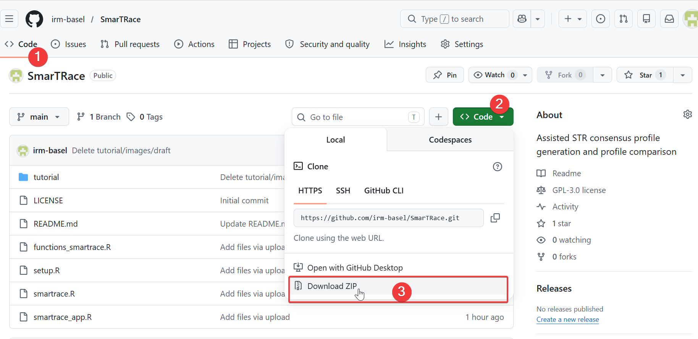
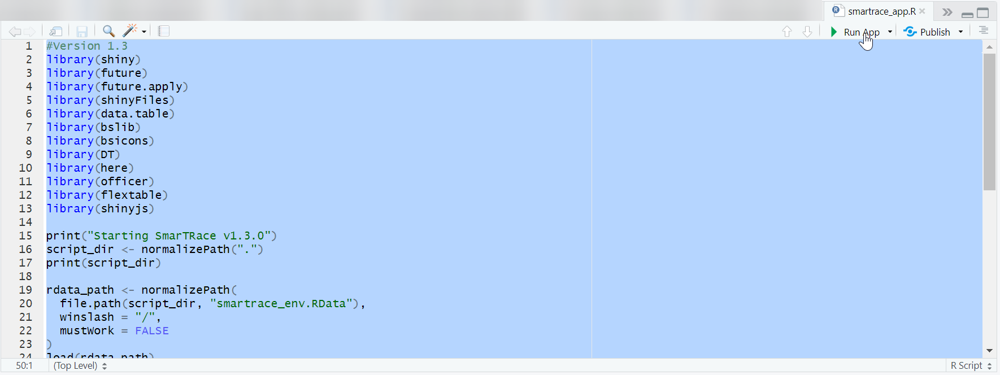
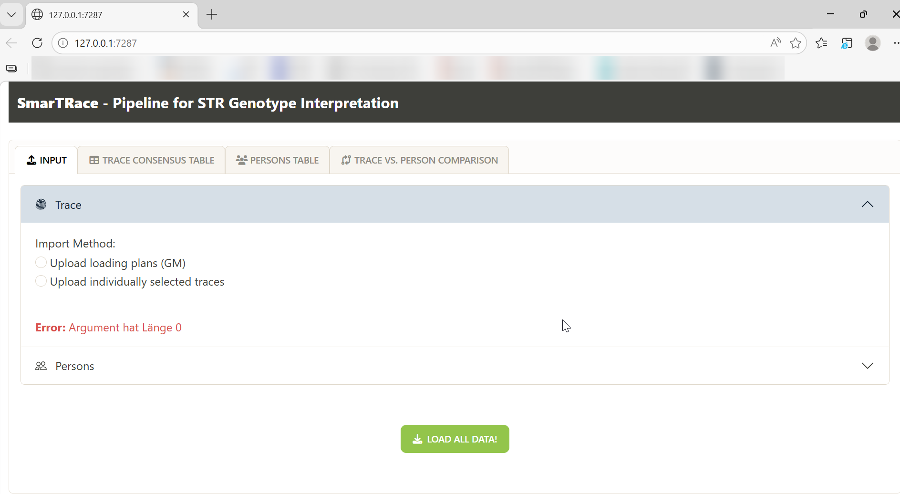
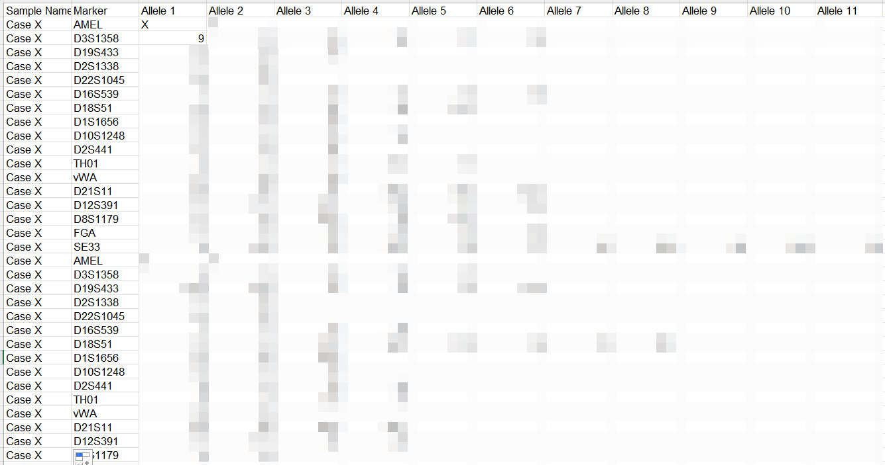
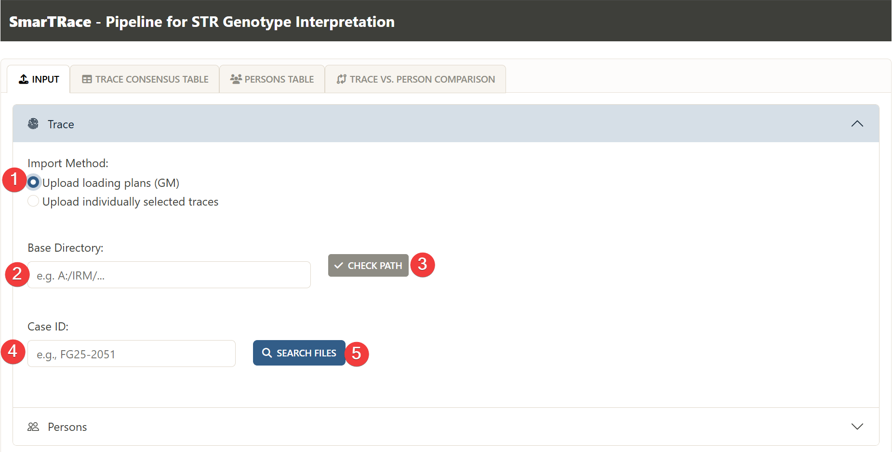

# SmarTRace
Assisted STR consensus profile generation and profile comparison

For automated and reproducible consensus profile generation based on independent STR profiles and comparison with reference profiles, we present the user-friendly and efficient software, SmarTRace.

## Requirements and Installation
1. R and R Studio need to be available
2. Download the most recent SmarTRace repository ZIP file 
 
3. Unzip downloaded folder "SmarTRace" and navigate to folder that contains .R Scripts 
4. Install the required R libraries by doubleclicking and then sourcing "setup.R" as shown here: 
 

## Start SmarTRace
1. Double-click "smartrace_app.R" to open in RStudio 
2. Run entire "smartrace_app.R", e.g., by marking all and Clicking "Run App" 
 
3. A window opens up in the default explorer 
 
4. First upload the trace profile using the standard GeneMapper export file (1) or manual input (2) 

### 4.1 The GeneMapper (GM)

   4.1.1 The GM export file should contain a case code, the used systems/loci and at least the alleles observed per system. This is an example GM file: 
 
   4.1.2 The user needs to select the GM export table as input and then define the path to the folder, where GM export files are located. When picking "check" the path, this path will be saved for future uses as the location with GM export files. But this location can be changed anytime.
 
   
6. 5
7. 

 

