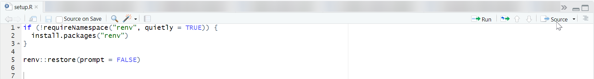

# SmarTRace
Assisted STR consensus profile generation and profile comparison

For automated and reproducible consensus profile generation based on independent STR profiles and comparison with reference profiles, we present the user-friendly and efficient software, SmarTRace.

## Requirements and Installation
1. R and R Studio need to be available
2. Install the required R libraries by sourcing "setup.R" as shown here: 
 

