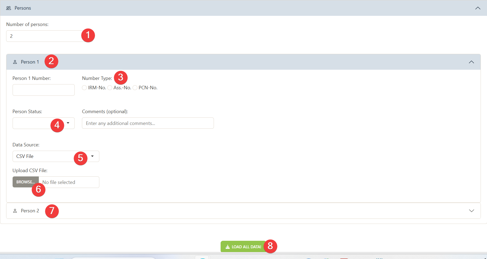
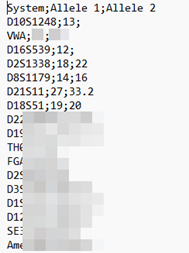
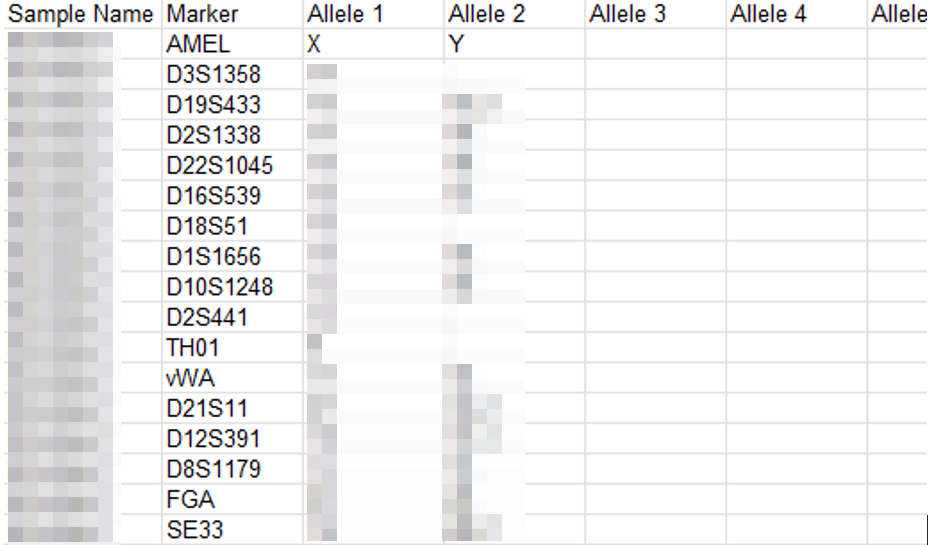
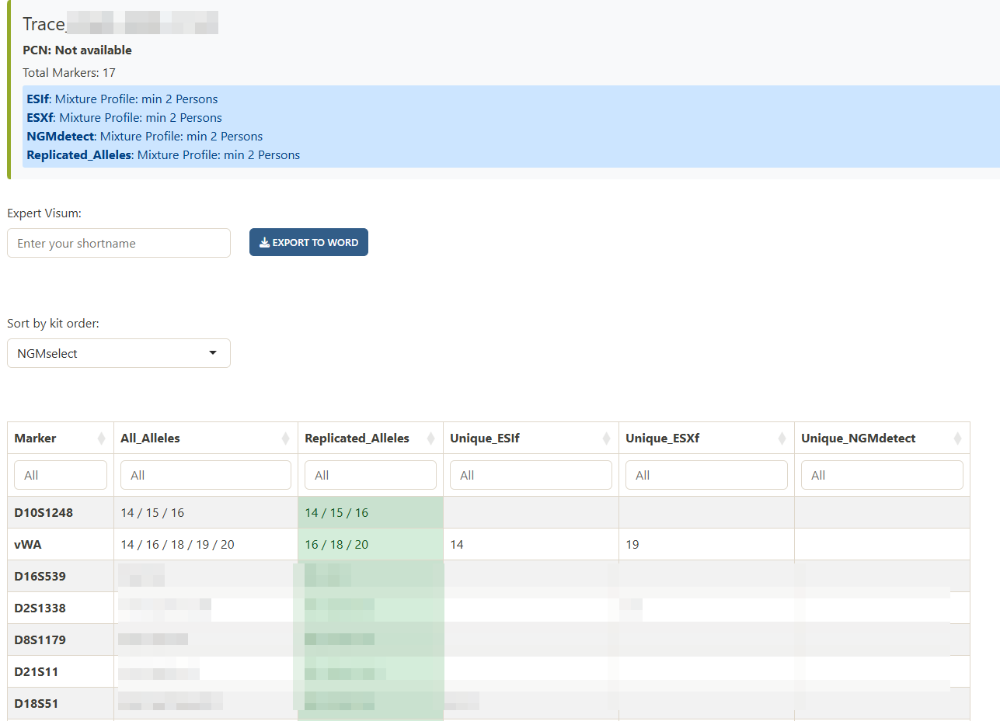
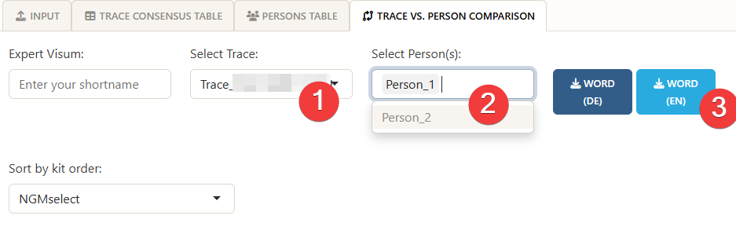
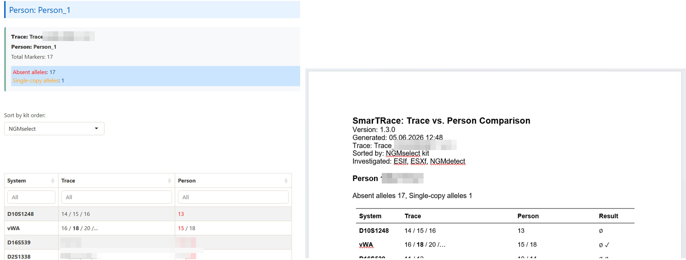

# SmarTRace
Assisted STR consensus profile generation and profile comparison

For automated and reproducible consensus profile generation based on STR profiles and comparison with reference profiles, we present the user-friendly and efficient software, SmarTRace.

## Requirements and Installation
1. R and R Studio need to be available
2. Download the most recent SmarTRace repository ZIP file 
 
3. Unzip downloaded folder "SmarTRace" and navigate to folder that contains .R Scripts 
4. Install the required R libraries by doubleclicking and then sourcing "setup.R" as shown here: 
 

## Start SmarTRace
1. Double-click "smartrace_app.R" to open in RStudio 
2. Run entire "smartrace_app.R", e.g., by marking all and clicking "Run App" 
 
3. A window opens up in the default explorer.  
 
4. First upload the trace profile using the standard GeneMapper export file (1) or manual input (2) 
&nbsp;&nbsp;&nbsp;&nbsp; 4.1 The GeneMapper (GM)  
&nbsp;&nbsp;&nbsp;&nbsp;&nbsp;&nbsp;&nbsp;&nbsp;   4.1.1 The GM export file should contain a case code, the used systems/loci and at least the alleles observed per system. This is an example GM file: 
 
&nbsp;&nbsp;&nbsp;&nbsp;&nbsp;&nbsp;&nbsp;&nbsp;   4.1.2 The user needs to select the GM export table as input and then define the path to the folder, where the users' GM export files are located. When picking "check path", first the validity of the path will be checked and then this path will be saved for future uses as the location with GM export files. But this location can be changed anytime. Then the "Case ID" or sample name needs to be entered. In the above example that would be "Case X" and helps to find the right DNA profiles across GM export files. Finally, the user selects "Search files". Depending on the number of files located in the defined path, this step may take some time, as visualized by a progress bar (not shown). The user should wait for this process to be done, before continuing. 
 
   
5. When the traces have been found, the user can select "Persons" to select the reference persons.
 
&nbsp;&nbsp;&nbsp;&nbsp; The user selects the number of reference persons and after one drop-down box per person is created, the user can pick the first person. For each person, the user can select the number type and person status (suspect, victim, staff). The data source (or format) has to be selected. The default is the CSV file. For this, the following semicolon-separated format is accepted.
 
&nbsp;&nbsp;&nbsp;&nbsp; After uploading the file, SmarTRace extracts the sample name from the file name (filename without '.csv').  

&nbsp;&nbsp;&nbsp;&nbsp; Alternative input formats are:  
&nbsp;&nbsp;&nbsp;&nbsp;&nbsp;&nbsp;&nbsp;&nbsp; - GeneMapper i/med Export: Upload the default GeneMapper export file of the reference person's profile 
&nbsp;&nbsp;&nbsp;&nbsp;&nbsp;&nbsp;&nbsp;&nbsp; - Statistefix CSV:  
&nbsp;&nbsp;&nbsp;&nbsp;&nbsp;&nbsp;&nbsp;&nbsp;   
&nbsp;&nbsp;&nbsp;&nbsp;&nbsp;&nbsp;&nbsp;&nbsp; - Manually add: Here the alleles can be manually added.  

7. Select "Load all data"

## Output ##
8. Navigate to "Trace consensus table" to view the consensus profile based on replicated alleles (in at least 2 PCRs) observed across the PCRs. 

9. Navigate to "Persons table" to view the uploaded profiles of the reference persons. 
10. Navigate to "trace vs. person comparison" to view the comparison of each reference person with the trace sample. The user can select the trace of interest (if there are several) and which of the reference persons to compare it to. An English or German report in Word of the comparison can be downloaded with the "WORD" button.  

11. The comparison between each reference person and the trace sample can be viewed in the SmarTRace interface (left) or in the downloaded Word document (right):  

The "trace" column contains the alleles replicated in at least 2 PCRs of the trace sample. In bold are those alleles that were also found in the reference person. And in bold and round brackets are alleles that were only observed in one PCR, but were also observed in the reference sample. Alleles not replicated in at least 2 PCRs of the trace sample and absent in the reference sample are not explicitly presented in the "trace" column. The "Person" columns presents the alleles found in the reference person. 
- Alleles of the reference person that have been found replicated in the trace sample are (1) coloured in black in the SmarTRace interface. (2) In the Word document, this allele is denoted with a check mark (✓) in the "Result" column. 
- Alleles of the reference person that have not been found in the trace sample are (1) coloured in red in the SmarTRace interface. (2) In the Word document, this allele is denoted with a slashed O (Ø). 
- Alleles of the reference person that have been found in one PCR (i.e., not replicated) in the trace sample are (1) coloured in orange in the SmarTRace interface. (2) In the Word document, this allele is denoted with a tilde (~) in the "Result" column.

 

